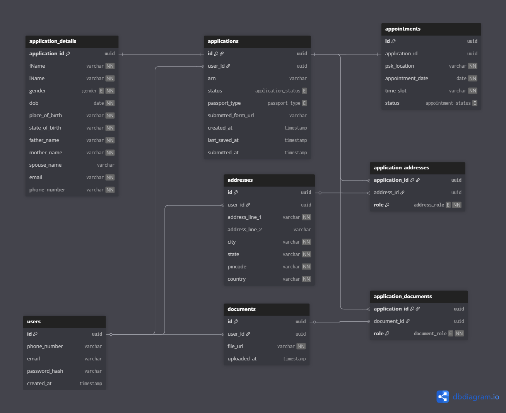

# Passport Seva Portal

Passport Seva Portal is a full-stack web application for passport application onboarding, authentication, and multi-step form processing.

## Live URL

https://passport.atttrack.online/

## Project Structure

```text
passport-seva-portal/
├─ backend/   # FastAPI + Prisma (Python)
├─ frontend/  # Next.js (App Router) + TypeScript + Tailwind
├─ database_schema.png
└─ README.md
```

## Tech Stack

### Frontend

- Next.js 15 (App Router)
- React 18 + TypeScript
- Tailwind CSS
- Axios (API calls)
- React Query
- React Toastify

### Backend

- FastAPI
- Uvicorn
- Prisma Client Python (`prisma-client-py`)
- MySQL
- JWT-based authentication

### Tooling

- ESLint
- Prettier

## Initialization and Setup

## 1) Clone the repository

```bash
git clone <your-repo-url>
cd passport-seva-portal
```

## 2) Backend setup (FastAPI)

Move to backend:

```bash
cd backend
```

Create and activate virtual environment:

```bash
python -m venv venv
venv\Scripts\activate
```

Install dependencies:

```bash
pip install -r requirements.txt
```

Set environment variables in `backend/.env`:

```env
DATABASE_URL="mysql://<USER>:<PASSWORD>@<HOST>:<PORT>/<DB_NAME>"
DATABASE_PASSWORD="your_db_password_if_using_<PASSWORD>_placeholder"
JWT_SECRET="your_jwt_secret"
JWT_EXPIRATION_DELTA=3600
OTP_SECRET="your_otp_secret"
FRONTEND_URL="http://localhost:3000"
PORT=8000
ENVIRONMENT="development"
```

Generate Prisma client (from backend root):

```bash
prisma generate --schema prisma/schema.prisma
```

Run backend server:

```bash
python server.py
```

Backend runs on: `http://localhost:8000`

## 3) Frontend setup (Next.js)

In a new terminal:

```bash
cd frontend
npm install
```

Set environment variables in `frontend/.env.local`:

```env
NEXT_PUBLIC_API_URL="http://localhost:8000"
```

Run frontend dev server:

```bash
npm run dev
```

Frontend runs on: `http://localhost:3000`

## 4) Production build check

From `frontend/`:

```bash
npm run build
```

## API Overview (High-Level)

### Auth routes

- `POST /auth/register`
- `POST /auth/login/email`
- `POST /auth/login/otp/send`
- `POST /auth/login/otp/verify`
- `GET /auth/verify`

### Form routes (protected)

- `POST /form/new-form`
- `GET /form/details/{application_id}`
- `PATCH /form/save/{application_id}`
- `PATCH /form/submit/{application_id}`
- `GET /form/all`

## Database Design (Brief)

The schema is designed around user-centric applications with normalized entities:

- `users`: stores account identity (email/phone/password hash).
- `applications`: primary passport application records (`DRAFT`, `SUBMITTED`, etc.), ARN, and progress state.
- `application_details`: one-to-one personal and family details for each application.
- `addresses`: reusable address records for a user.
- `documents`: uploaded document metadata (file URL, upload timestamp).
- `application_addresses`: maps an application to addresses with roles (`PRESENT`, `PERMANENT`, `EMERGENCY`).
- `application_documents`: maps an application to document roles (`PROOF_OF_DOB`, `PRESENT_ADDRESS_PROOF`, `NON_ECR_PROOF`).
- `appointments`: passport seva appointment scheduling linked to an application.

This separation keeps data clean, supports role-based document/address mapping, and makes application state transitions easy to manage.

## Database Schema Diagram



## Notes

- The frontend uses server-side proxy routes under `frontend/src/app/api/form/*` to forward authenticated requests to backend form endpoints.
- Auth state is maintained via token cookies and validated through `/auth/verify`.
